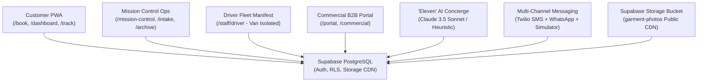

# ⚽ First Eleven Cleaners — Modern On-Demand Garment Care & Fleet Logistics Platform

> **"You Look Match-Ready. Every Single Day."**  
> First Eleven Cleaners is an enterprise-grade, on-demand dry cleaning, wash & fold, and commercial textile logistics platform operating across the Dallas–Fort Worth Metroplex.  
> **Brand & Operator:** Lydia Painting, LLC (d/b/a First Eleven Cleaners) • Dallas, Texas  
> **Certifications:** SDVOSB (Service-Disabled Veteran-Owned) • Veteran-HUB • MBE • DBE

---

## 🌟 Executive Platform Overview

First Eleven Cleaners pairs **Carvana-level visual transparency** and **Domino's-style live order tracking** with an **intelligent AI Concierge ("Eleven")**, an **industrial plant operations suite (Mission Control)**, a **dedicated Driver Fleet Manifest with strict van isolation**, and a **Commercial B2B Logistics Portal**.



---

## 🚀 Key System Features

### 1. 🧺 Customer Experience PWA (`/`, `/book`, `/dashboard`, `/track/[orderId]`)
* **5-Step Frictionless Booking:** Auto-coverage check across DFW zones, dynamic Wash & Fold weight slider with real-time tariff calculation, dry-cleaning item selector, and morning/evening pickup windows.
* **Live 6-Stage Domino's Order Tracker:** Real-time visual progress from *Booked ➔ Picked Up ➔ Weighed & Itemized ➔ In Cleaning ➔ Out for Delivery ➔ Delivered*.
* **48-Hour Match-Ready Guarantee Counter:** Live countdown timer with automated $10 credit trigger if an order is delayed past its turnaround SLA.
* **Garment Passport™ Visual Timeline:** Side-by-side split view comparing **Intake Digital Inspection** (with pre-existing flaw & stain notes) vs. pristine **Pressed & Delivered Return**.
* **100% Make It Right Claim Portal (`/claim/[orderId]`):** Streamlined photo-upload claim filing for any garment care or delivery issue.

### 2. 🎛️ Mission Control Central Operations (`/mission-control`, `/mission-control/intake`)
* **5-Stage Active WIP Pipeline:** High-efficiency plant kanban focused exclusively on work-in-progress stages (*Booked*, *Picked Up*, *Weighed & Itemized*, *In Cleaning*, *Out for Delivery*) with 1-click stage advancement and multi-channel customer notification triggers.
* **Time-Scoped & Collapsible "Delivered Today" Column:** High-density column displaying orders completed today. Features independent scrolling (`max-height: 560px`), sticky summary counters, and a 1-click `[◀ Collapse / Expand ▶]` toggle that minimizes historical orders into a compact indicator bar to maximize plant WIP screen real estate.
* **Searchable Delivered & Completed Archive:** Dedicated audit ledger accessible via view-switcher pills (`⚡ Live Active Board` vs `📦 Delivered & Completed Archive`). Includes multi-criteria search (order #, customer name, street, driver), date range filters (*All Time, Today, Past 7 Days, Past 30 Days*), gross revenue & volume metrics, proof-of-delivery photo modal, and printable receipts.
* **Barcode & Camera Central Intake Station (`/mission-control/intake`):** Rapid garment check-in for gross scale weight recording, dry-cleaning itemization, direct device camera trigger and multi-file upload (`.jpg`, `.png`, `.webp`, `.heic`), automated public CDN streaming to Supabase Storage (`garment-photos`), pre-existing flaw notes, and side-by-side inspection against driver doorstep pickup proof.
* **Real-Time Financials & Transactions Ledger:** Enterprise financial tracking of gross revenue, Square transaction IDs, settled card charges, pre-authorizations, and Net-30 commercial receivables.
* **Make It Right Claims Resolution Center:** 1-click resolution presets for *🔄 Free Re-Clean*, *💰 Monetary Refund*, or *💬 Care Explanation*.
* **Multi-Channel Messaging HUD & Simulator:** Real-time outgoing SMS and WhatsApp delivery audit feed with automated escalation tags for **`🚨 AI Escalations`**.
* **Fleet & Staff Operations Roster:** Central directory managing driver and plant specialist assignments, system roles, and shifts.

### 3. 🚚 Driver Fleet Manifest (`/staff/driver`)
* **Strict Multi-Tenancy & Van Route Isolation:** Real-time route isolation ensures that when a driver loads an order into their van (*"Load into My Van"*), the stop is claimed exclusively by that driver and immediately disappears from all other drivers' active manifests.
* **Server-Side Route Protection:** Backend API guards enforce strict fleet authorization:
  - Prevents double-claiming across vans (`409 Conflict`).
  - Blocks unauthorized cross-driver delivery completion (`403 Forbidden`).
  - Guards against duplicate pickups (`409 Conflict`).
* **Dual-Stream Manifest Interface:** Side-by-side and focused stream views separating **Inbound to Plant** (*To Pick Up*, *In My Van*, *Picked Up Completed*) from **Outbound to Customers** (*Ready at Plant to Load*, *Active Drops in Van*, *Delivered*).
* **Route Actions:** 1-click direct phone dialer (`tel:`), GPS turn-by-turn navigation mapping (`maps.google.com`), and mandatory contactless doorstep photo proof camera capture.

### 4. ✨ "Eleven" AI Concierge Engine (`/api/concierge`, Floating Widget)
* **Decoupled AI Engine Provider Pattern (`IAIEngineProvider`):** Built-in smart Heuristic Engine ($0 cost, memory-aware) with instant plug-and-play Claude 3.5 Sonnet activation via `ANTHROPIC_API_KEY`.
* **"Eleven's Memory" Integration:** Automatically reads and respects customer preferences (starch level, fold vs hangers, hypoallergenic detergent).
* **Conversational Booking:** Understands booking requests (*"Book my usual for tomorrow morning"*).
* **Automatic Multilingual Support:** Automatically detects and responds in fluent English or Spanish.
* **Human Escalation:** Flags complex issues and logs priority alerts directly into Mission Control.

### 5. 🏢 Commercial B2B Logistics Portal (`/portal`, `/commercial`)
* **Corporate Account Switcher:** Multi-account interface tailored for hotels, medical spas, fitness clubs, and property managers.
* **Executive KPI Dashboard:** Real-time tracking of monthly volume (lbs), RFID hamper carts, and 100% on-time SLA turnaround.
* **Contract Rate Card Inspector:** Locked negotiated bulk pricing ($1.75/lb towel service, $14.50 valet suits).
* **Automated Route Schedule Manager:** Edit recurring pickup schedules (e.g. Mon/Wed/Fri morning shift).
* **Consolidated Monthly Invoices:** Itemized monthly statements with a 1-click printable PDF view and Net-30 settlement.

### 6. 📈 Growth, Compliance & Promotions
* **Dynamic Promo Code Engine (`/api/promo/validate`):** Connected to live Supabase `promo_codes` table with date validation, max-use limits, atomic usage increments, and fallback resilience.
* **Texas Data Privacy Compliance (TDPSA):** Authenticated consumer data deletion and export endpoint (`/api/customer/data-deletion`) supporting statutory data erasure and portability rights.
* **Local Dallas SEO Architecture:** Dynamic `/robots.txt`, `/sitemap.xml`, JSON-LD `DryCleaningOrLaundryService` schema with DFW coverage coordinates, and W3C compliant maskable PWA manifest.
* **Post-Delivery Review Booster:** Automated prompt 2 hours post-delivery with direct 5-star Google review link.
* **Churn Win-Back Model:** Detects inactive customers ($\ge 21$ days) and issues personalized `COMEBACK15` discounts.

---

## 🛠️ Technology Stack

| Layer | Technology | Purpose |
| :--- | :--- | :--- |
| **Framework** | [Next.js 16 (App Router + Turbopack)](https://nextjs.org/) | Core full-stack application and serverless API routes |
| **Language** | [TypeScript 5 (Strict Mode)](https://www.typescriptlang.org/) | Complete type safety and domain models |
| **Styling** | Vanilla CSS + Design System Tokens | Custom HSL palette (`Navy #0B1F3A`, `Gold #C9A14A`, `Pitch Green #1E5B3A`, `Cream #F4F2EC`) |
| **State & Data Fetching** | [TanStack React Query v5](https://tanstack.com/query), [Zustand](https://zustand-demo.pmnd.rs/) | Server cache invalidation and client state management |
| **Database & Auth** | [Supabase](https://supabase.com/) (PostgreSQL + RLS) | Relational storage, row-level security, auth session handling |
| **Media Storage** | [Supabase Storage](https://supabase.com/storage) (`garment-photos`) | Public CDN for intake inspection and proof-of-delivery photos |
| **Payments** | [Square Web Payments SDK](https://developer.squareup.com/docs/web-payments) | PCI-compliant tokenized credit card processing |
| **Messaging** | Multi-Provider Engine (Simulator + [Twilio](https://www.twilio.com/) + [Resend](https://resend.com/)) | Transactional SMS, WhatsApp, and email alerts |
| **AI Concierge** | Multi-Provider Engine (Simulated Heuristic + [Claude 3.5 Sonnet](https://www.anthropic.com/)) | Conversational AI concierge with memory |
| **Testing** | [Vitest](https://vitest.dev/) | 34 automated unit, integration, and compliance test suites |

---

## 📁 Repository Structure

```
first-eleven-cleaners/
├── PROJECT_CONTEXT.md          # Brand guidelines, business rules, and technical specifications
├── ROADMAP.md                  # 14-Week phased milestone roadmap and progress tracking
├── README.md                   # Platform documentation and developer guide
├── web/                        # Next.js 16 Web Application
│   ├── public/                 # Static assets, logos, PWA manifest
│   ├── src/
│   │   ├── app/                # Next.js App Router (36 routes)
│   │   │   ├── (auth)/         # /login, /signup, /forgot-password
│   │   │   ├── api/            # Serverless API routes (orders, driver, intake, claims, concierge, etc.)
│   │   │   ├── book/           # 5-step customer booking flow
│   │   │   ├── claim/          # Make It Right claim portal
│   │   │   ├── commercial/     # Commercial B2B landing & inquiry
│   │   │   ├── dashboard/      # Customer portal (orders, addresses, preferences)
│   │   │   ├── mission-control/# Central ops board, intake station, archive, claims HUD
│   │   │   ├── portal/         # Commercial B2B enterprise portal
│   │   │   ├── pricing/        # Transparent rate card & calculator
│   │   │   ├── staff/driver/   # Driver mobile manifest (van-isolated)
│   │   │   └── track/          # Domino's 6-stage order tracker
│   │   ├── components/         # Reusable UI component library & modals
│   │   │   ├── mission-control/# KanbanBoard, DeliveredArchive, IntakeStation, Roster
│   │   │   ├── orders/         # GarmentPassportTimeline, DominoTracker, ClaimModal
│   │   │   └── ui/             # Button, Badge, Modal, Card, Input, Tabs
│   │   ├── hooks/              # React Query custom hooks (useOrders, useDriver, useIntake)
│   │   ├── lib/                # Core business logic & decoupled providers
│   │   │   ├── ai/             # Eleven AI Concierge engine (Claude & Simulated)
│   │   │   ├── commercial/     # Commercial rate cards & invoice service
│   │   │   ├── growth/         # Review booster & churn win-back engine
│   │   │   ├── messaging/      # Twilio SMS / WhatsApp / Simulator provider
│   │   │   ├── payments/       # Square Web Payments integration
│   │   │   ├── storage/        # Supabase Storage photo upload & CDN resolver
│   │   │   └── supabase/       # Supabase SSR & Service-Role admin clients
│   │   ├── stores/             # Zustand UI & booking stores
│   │   ├── styles/             # Global CSS design tokens and variables
│   │   └── types/              # Comprehensive TypeScript interfaces
│   ├── supabase/               # PostgreSQL schema migrations and seed datasets
│   │   ├── schema.sql          # 15 tables, indexes, RLS policies, and triggers
│   │   └── seed.sql            # Dallas zones, promo codes, and time slots
│   └── tests/                  # Vitest automated test suites (34 tests, 7 suites)
```

---

## 💻 Local Setup & Development

### 1. Prerequisites
* [Node.js](https://nodejs.org/) (v18.18 or later)
* [npm](https://www.npmjs.com/) (v9 or later)
* A [Supabase](https://supabase.com/) project (PostgreSQL + Auth + Storage)

### 2. Installation
```bash
# Clone the repository
git clone <YOUR_REPOSITORY_URL>
cd "first eleven cleaners/web"

# Install dependencies
npm install
```

### 3. Environment Configuration
Copy the template to create your `.env.local`:
```bash
cp .env.example .env.local
```

Fill in your configuration keys in `web/.env.local`:
```env
# --- Supabase ---
NEXT_PUBLIC_SUPABASE_URL=https://your-project.supabase.co
NEXT_PUBLIC_SUPABASE_ANON_KEY=your-anon-key
SUPABASE_SERVICE_ROLE_KEY=your-service-role-key

# --- Square Payments (Sandbox / Production) ---
NEXT_PUBLIC_SQUARE_APP_ID=your-square-app-id
NEXT_PUBLIC_SQUARE_LOCATION_ID=your-square-location-id
SQUARE_ACCESS_TOKEN=your-square-access-token
SQUARE_ENVIRONMENT=sandbox
SQUARE_WEBHOOK_SIGNATURE_KEY=your-webhook-key

# --- Twilio (Optional - defaults to Simulated HUD if empty) ---
TWILIO_ACCOUNT_SID=
TWILIO_AUTH_TOKEN=
TWILIO_PHONE_NUMBER=
TWILIO_WHATSAPP_NUMBER=

# --- Resend Email (Optional) ---
RESEND_API_KEY=
RESEND_FROM_EMAIL=First Eleven Cleaners <concierge@firstelevencleaners.com>

# --- Claude AI (Optional - defaults to Eleven Heuristic Engine if empty) ---
ANTHROPIC_API_KEY=

# --- App Configuration ---
NEXT_PUBLIC_APP_URL=http://localhost:3000
NEXT_PUBLIC_APP_NAME="First Eleven Cleaners"
```

### 4. Database Setup
1. Open your **Supabase Project Dashboard**.
2. In the **SQL Editor**, execute [`web/supabase/schema.sql`](web/supabase/schema.sql) to provision all 15 tables, relational indexes, RLS policies, and triggers.
3. In the **SQL Editor**, execute [`web/supabase/seed.sql`](web/supabase/seed.sql) to seed DFW service zones, active promo codes, and 14-day operational time slots.

### 5. Supabase Storage Bucket Setup (`garment-photos`)
The intake digital inspection station and driver proof-of-delivery system upload photos directly to Supabase Storage:
1. In the **Supabase Dashboard**, navigate to **Storage** ➔ **New Bucket**.
2. Name the bucket: `garment-photos`.
3. Toggle **Public Bucket** to **ON** (this allows fast CDN image loading for the Garment Passport™ and driver proof cards).
4. Set **File size limit** to `10MB`.
5. Set **Allowed MIME types** to `image/jpeg, image/png, image/webp, image/heic`.
6. Click **Save bucket**.
7. *(Optional RLS)* Under **Storage Policies**, ensure public read is enabled (`SELECT` allowed for all users) and authenticated/service-role insert is permitted (`INSERT` allowed for authenticated staff).

### 6. Running Locally
```bash
# Start the local Next.js development server with Turbopack
npm run dev
```
Open [http://localhost:3000](http://localhost:3000) in your browser.

### 7. Automated Testing & Verification
```bash
# Run Vitest test suite (34 tests across 7 test suites)
npm test

# Run tests in watch mode
npm run test:watch

# Run strict TypeScript type compilation check
npx tsc --noEmit

# Run ESLint validation across all pages and APIs
npm run lint

# Validate optimized production build
npm run build
```

---

## 🔒 Security & Regulatory Compliance

* **Zero Secrets in Git:** All secrets, service role keys, and environment files are strictly ignored via `.gitignore`.
* **Row-Level Security (RLS):** All Supabase tables enforce strict RLS policies ensuring customers can only access their own orders, addresses, and claims.
* **Driver Van Isolation:** Server-side validation strictly binds van drop actions to the authenticated driver, preventing double-claims and unauthorized cross-driver delivery completion.
* **Service-Role Isolation:** Admin, driver manifest, and intake operations run via protected server-only routes (`createAdminClient()`).
* **Texas Data Privacy and Security Act (TDPSA):** Compliant endpoints for consumer data deletion and portable data export (`/api/customer/data-deletion`).
* **API Rate Limiting:** Sliding-window rate limiters protect API routes from brute force and denial of service.

---

## 📄 License & Ownership
Copyright © 2026 **First Eleven Cleaners**. Operated by **Lydia Painting, LLC** (Dallas, Texas). All rights reserved.

