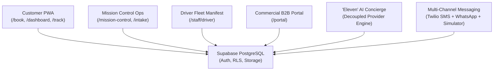

# ⚽ First Eleven Cleaners — Modern On-Demand Garment Care & Fleet Logistics Platform

> **"You Look Match-Ready. Every Single Day."**  
> First Eleven Cleaners is a high-performance, on-demand dry cleaning, wash & fold, and commercial textile logistics platform operating across the Dallas–Fort Worth Metroplex.  
> **Brand & Operator:** Lydia Painting, LLC (d/b/a First Eleven Cleaners) • Dallas, Texas  
> **Certifications:** SDVOSB (Service-Disabled Veteran-Owned) • Veteran-HUB • MBE • DBE

---

## 🌟 Executive Platform Overview

First Eleven Cleaners pairs **Carvana-level visual transparency** and **Domino's-style live order tracking** with an **intelligent AI Concierge ("Eleven")** and a dedicated **Commercial B2B Logistics Portal**.



---

## 🚀 Key System Features

### 1. 🧺 Customer Experience PWA (`/`, `/book`, `/dashboard`, `/track/[orderId]`)
* **5-Step Frictionless Booking:** Auto-coverage check across DFW zones, dynamic Wash & Fold weight slider, dry-cleaning item selector, and morning/evening pickup windows.
* **Live 6-Stage Domino's Order Tracker:** Real-time visual progress from *Booked ➔ Picked Up ➔ Weighed & Itemized ➔ Eco-Cleaning ➔ Out for Delivery ➔ Delivered*.
* **48-Hour Match-Ready Guarantee Counter:** Real-time countdown timer with automated $10 credit trigger if delayed.
* **Garment Passport™ Visual Timeline:** Side-by-side split view comparing **Intake Digital Inspection** (with pre-existing flaw & stain notes) vs. pristine **Pressed & Delivered Return**.
* **100% Make It Right Claim Portal (`/claim/[orderId]`):** Easy photo-upload claim filing for any satisfaction issue.

### 2. 🎛️ Mission Control Central Operations (`/mission-control`, `/mission-control/intake`)
* **Plant Workflow Kanban:** Central board managing orders across all 6 stages with 1-click stage advancement.
* **Barcode & Camera Intake Station (`/mission-control/intake`):** Live intake flow for weight recording, dry cleaning garment categorization, high-res photo uploads with condition flags, and duplicate SMS protection.
* **Make It Right Claims Resolution Center:** 1-click presets for *🔄 Free Re-Clean*, *💰 Monetary Refund*, or *💬 Care Explanation*.
* **Real-Time SMS & WhatsApp Simulator HUD:** Live outgoing message audit feed with automated highlight tags for **`🚨 AI Escalations`**.

### 3. 🚚 Driver Fleet Manifest (`/staff/driver`)
* **High-Contrast Mobile Manifest:** 4 distinct tabs: *To Pick Up*, *In Transit to Plant*, *To Deliver*, and *Picked Up History*.
* **Route Actions:** 1-click direct calling (`tel:`), GPS navigation mapping (`maps.google.com`), and delivery photo proof camera capture.

### 4. ✨ "Eleven" AI Concierge Engine (`/api/concierge`, Floating Widget)
* **Decoupled AI Engine Provider Pattern (`IAIEngineProvider`):** Built-in smart Heuristic Engine ($0 cost, memory-aware) with instant plug-and-play Claude 3.5 Sonnet activation.
* **"Eleven's Memory" Integration:** Automatically reads and respects customer preferences (starch level, fold vs hangers, hypoallergenic detergent).
* **Conversational Booking:** Understands booking requests (*"Book my usual for tomorrow morning"*).
* **Automatic Multilingual Support:** Automatically detects and answers in fluent English or Spanish.
* **Human Escalation:** Flags complex issues and logs priority alerts directly into Mission Control.

### 5. 🏢 Commercial B2B Logistics Portal (`/portal`, `/commercial`)
* **Corporate Account Switcher:** Multi-account interface tailored for hotels, medical spas, fitness clubs, and property managers.
* **Executive KPI Dashboard:** Real-time tracking of monthly volume (lbs), RFID hamper carts, and 100% on-time SLA turnaround.
* **Contract Rate Card Inspector:** Locked negotiated bulk pricing ($1.75/lb towel service, $14.50 valet suits).
* **Automated Route Schedule Manager:** Edit recurring pickup schedules (e.g. Mon/Wed/Fri morning shift).
* **Consolidated Monthly Invoices:** Itemized monthly statements with a 1-click printable PDF view and Net-30 settlement.

### 6. 📈 Growth & Customer Retention Automations (`/api/growth`)
* **Post-Delivery Review Booster:** Automated prompt 2 hours post-delivery with direct 5-star Google review link.
* **Churn Win-Back Model:** Detects inactive customers ($\ge 21$ days) and issues personalized `COMEBACK15` discounts.
* **POS Attach Recommendation Engine:** Suggests bundling suits or dress shirts during Wash & Fold booking checkout with zero added delivery fees.

---

## 🛠️ Technology Stack

| Layer | Technology |
| :--- | :--- |
| **Framework** | [Next.js 16 (App Router + Turbopack)](https://nextjs.org/) |
| **Language** | [TypeScript (Strict Mode)](https://www.typescriptlang.org/) |
| **Styling** | Vanilla CSS with Custom Design Tokens (`Navy #0B1F3A`, `Gold #C9A14A`, `Pitch Green #1E5B3A`, `Cream #F4F2EC`) |
| **State & Data Fetching** | [TanStack React Query v5](https://tanstack.com/query), [Zustand](https://zustand-demo.pmnd.rs/) |
| **Database & Auth** | [Supabase](https://supabase.com/) (PostgreSQL with RLS, Storage Buckets, SSG/SSR Auth Helpers) |
| **Payments** | [Square Web Payments SDK](https://developer.squareup.com/docs/web-payments) |
| **Messaging** | Multi-Provider Engine (Simulated Provider HUD + [Twilio SMS / WhatsApp](https://www.twilio.com/)) |
| **AI Intelligence** | Multi-Provider Engine (Simulated Heuristic Provider + [Anthropic Claude 3.5 Sonnet](https://www.anthropic.com/)) |

---

## 📁 Repository Structure

```
first-eleven-cleaners/
├── PROJECT_CONTEXT.md          # Brand guidelines, business rules, and technical specifications
├── ROADMAP.md                  # 14-Week phased milestone roadmap and progress tracking
├── documents/                  # Business proposals, competitive analysis, and assets
└── web/                        # Next.js 16 Web Application
    ├── public/                 # Static assets, logos, PWA manifest
    ├── src/
    │   ├── app/                # Next.js App Router (36 routes)
    │   │   ├── (auth)/         # /login, /signup, /forgot-password
    │   │   ├── api/            # Serverless API route handlers
    │   │   ├── book/           # 5-step customer booking flow
    │   │   ├── claim/          # Make It Right claim portal
    │   │   ├── commercial/     # Commercial B2B landing & inquiry
    │   │   ├── dashboard/      # Customer portal (orders, addresses, preferences)
    │   │   ├── mission-control/# Central ops kanban, intake station, claims HUD
    │   │   ├── portal/         # Commercial B2B enterprise portal
    │   │   ├── pricing/        # Transparent rate card & calculator
    │   │   ├── staff/driver/   # Driver mobile manifest
    │   │   └── track/          # Domino's 6-stage order tracker
    │   ├── components/         # Reusable UI component library & modals
    │   ├── hooks/              # React Query custom hooks
    │   ├── lib/                # Core business logic & decoupled providers
    │   │   ├── ai/             # Eleven AI Concierge engine (Claude & Simulated)
    │   │   ├── commercial/     # Commercial rate cards & invoice service
    │   │   ├── growth/         # Review booster & churn win-back engine
    │   │   ├── messaging/      # Twilio SMS / WhatsApp / Simulator provider
    │   │   ├── payments/       # Square Web Payments integration
    │   │   └── supabase/       # Supabase SSR & Service-Role admin clients
    │   ├── stores/             # Zustand UI & booking stores
    │   ├── styles/             # Global CSS design tokens and variables
    │   └── types/              # Comprehensive TypeScript interfaces
    └── supabase/               # PostgreSQL schema migrations and seed datasets
```

---

## 💻 Local Setup & Development

### 1. Prerequisites
* [Node.js](https://nodejs.org/) (v18.18 or later)
* [npm](https://www.npmjs.com/) (v9 or later)

### 2. Installation
```bash
# Clone the repository
git clone <YOUR_REPOSITORY_URL>
cd "first eleven cleaners/web"

# Install dependencies
npm install
```

### 3. Environment Configuration
Copy the template to create your `.env.local`:
```bash
cp .env.example .env.local
```

Fill in your configuration keys in `web/.env.local`:
```env
# Supabase
NEXT_PUBLIC_SUPABASE_URL=https://your-project.supabase.co
NEXT_PUBLIC_SUPABASE_ANON_KEY=your-anon-key
SUPABASE_SERVICE_ROLE_KEY=your-service-role-key

# Square Payments (Sandbox / Production)
NEXT_PUBLIC_SQUARE_APP_ID=your-square-app-id
NEXT_PUBLIC_SQUARE_LOCATION_ID=your-square-location-id
SQUARE_ACCESS_TOKEN=your-square-access-token
SQUARE_ENVIRONMENT=sandbox

# Twilio (Optional - Multi-Provider defaults to Simulated HUD if empty)
TWILIO_ACCOUNT_SID=
TWILIO_AUTH_TOKEN=
TWILIO_PHONE_NUMBER=
TWILIO_WHATSAPP_NUMBER=

# Claude AI (Optional - Multi-Provider defaults to Eleven Heuristic Engine if empty)
ANTHROPIC_API_KEY=

# App Configuration
NEXT_PUBLIC_APP_URL=http://localhost:3000
NEXT_PUBLIC_APP_NAME="First Eleven Cleaners"
```

### 4. Database Setup
1. Open your Supabase Project Dashboard.
2. In the SQL Editor, execute [`web/supabase/schema.sql`](web/supabase/schema.sql) to provision all 15 tables, indexes, RLS policies, and triggers.
3. In the SQL Editor, execute [`web/supabase/seed.sql`](web/supabase/seed.sql) to seed staff accounts, test customers, time slots, and promo codes.

### 5. Running Locally
```bash
# Start the local Next.js development server
npm run dev
```
Open [http://localhost:3000](http://localhost:3000) in your browser.

### 6. Production Build Verification
```bash
# Validate TypeScript and create optimized production build
npm run build
```

---

## 🔒 Security Best Practices
* **Zero Secrets in Git:** All secrets, service keys, and environment files (`.env*`) are strictly gitignored via `.gitignore`.
* **Row-Level Security (RLS):** All Supabase database tables enforce strict RLS policies ensuring customers can only access their own orders, addresses, and claims.
* **Service-Role Isolation:** Admin and webhook operations utilize protected server-only routes (`createAdminClient()`).

---

## 📄 License & Ownership
Copyright © 2026 **First Eleven Cleaners**. Operated by **Lydia Painting, LLC**. All rights reserved.
