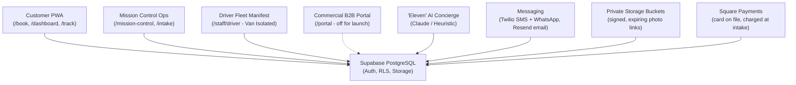

# ⚽ First Eleven Cleaners — Modern On-Demand Garment Care & Fleet Logistics Platform

> **"You Look Match-Ready. Every Single Day."**  
> First Eleven Cleaners is an on-demand dry cleaning, wash & fold, and pickup & delivery platform operating across the Dallas–Fort Worth Metroplex.  
> **Brand & Operator:** First Eleven Cleaners • Dallas, Texas  
> **Certifications:** SDVOSB (Service-Disabled Veteran-Owned) • Veteran-HUB • MBE • DBE

---

## 🌟 Executive Platform Overview

First Eleven Cleaners pairs **transparent, itemized pricing** and **live order tracking** with an **AI Concierge ("Eleven")**, a **plant operations suite (Mission Control)**, and a **Driver Fleet Manifest with van isolation**.


```mermaid
graph TD
    A["Customer PWA\n(/book, /dashboard, /track)"] --> E["Supabase PostgreSQL\n(Auth, RLS, Storage)"]
    B["Mission Control Ops\n(/mission-control, /intake)"] --> E
    C["Driver Fleet Manifest\n(/staff/driver - Van Isolated)"] --> E
    D["Commercial B2B Portal\n(/portal - off for launch)"] -.-> E
    F["'Eleven' AI Concierge\n(Claude / Heuristic)"] --> E
    G["Messaging\n(Twilio SMS + WhatsApp, Resend email)"] --> E
    H["Private Storage Buckets\n(signed, expiring photo links)"] --> E
    I["Square Payments\n(card on file, charged at intake)"] --> E
```

---

## 🚀 Key System Features

### 1. 🧺 Customer Experience PWA (`/`, `/book`, `/dashboard`, `/track/[orderId]`)
* **Guest-Friendly Booking:** Zone coverage check across DFW, Wash & Fold weight estimate, dry-cleaning and household item selector (napkins have a dozen price; "from" items such as wedding dresses and drapes are quoted at intake), and morning/evening pickup windows. First-time customers book without creating an account.
* **Server-Checked Schedule (Dallas time):** Standard pickups need 2 days' notice, never on Sunday, up to 60 days ahead. The plant runs Monday to Friday, so delivery is 2 plant days after pickup (Thursday pickups come back Monday; Friday and Saturday pickups Tuesday, and Saturday bookings say so). **24-Hour Express** is Mon-Thu, morning window only, delivered the next plant day, with 7 AM (same-day) and 9 PM (next-day) cutoffs, a +50% surcharge, and specialty garments and household items excluded. Window and Express capacity are enforced.
* **Safe Checkout:** Prices are recomputed on the server in whole cents. Each booking (order, items, promo use) is saved in one database transaction, and a double-click or retry returns the first order instead of booking twice.
* **See It as You Pay It:** The card is saved securely with Square at checkout (Square's own card form; card numbers never touch our servers) and a hold is placed for the estimate x 1.20 (at least $45 or the zone minimum): at booking when pickup is within 2 days, otherwise by the daily job 2 days before pickup. Checkout requires accepting the payment terms. Intake captures the actual itemized, taxed total automatically (lowering the hold, or capturing it and charging the rest), and the receipt carries the ticket, photos and two taps: *Looks good* or *Something's off* (opens a Make It Right claim). A declined card makes the order **Payment Needed**: cleaning continues, delivery waits until it's paid. Cancelling a pickup releases the hold.
* **Live Order Tracker:** Visual progress from *Booked ➔ Picked Up ➔ Weighed & Itemized ➔ In Cleaning ➔ Out for Delivery ➔ Delivered*, with readable dates and a Dallas-time "delayed" check. Cancelled pickups show a clear cancelled panel, and a failed load offers *Try Again* instead of "not found". Tracking links are private to the customer.
* **Garment Passport™ Photo Timeline:** Intake inspection photos (with pre-existing flaw notes) alongside pickup and delivery proof photos.
* **Billing & Receipts (`/dashboard/billing`):** Saved Square cards, itemized receipts, and a pay link for any order whose card was declined.
* **100% Make It Right Claims (`/claim/[orderId]`):** Claim filing for any garment care or delivery issue.
* **Accounts:** Guests are invited to create an account on the confirmation screen and in the confirmation email (email pre-filled). Plain-language sign-in and password messages, with the password rule stated up front.
* **Accessible by design:** WCAG AA text contrast (automated axe scan: 0 failures), visible keyboard focus, and 44 px tap targets on touch screens.

### 2. 🎛️ Mission Control Central Operations (`/mission-control`, `/mission-control/intake`)
* **Active WIP Pipeline:** Kanban of work-in-progress stages with enforced stage order (intake, the charge step, can't be skipped) and customer notifications on each advance.
* **Delivered & Completed Archive:** Searchable ledger with date filters, revenue and volume metrics, proof-of-delivery photos, and printable receipts.
* **Central Intake Station:** Weight recording, dry-cleaning itemization, camera capture and photo upload (resized on device), flaw notes, the customer's care preferences (starch, fold or hang, detergent), and automatic charge of the card on file.
* **Payments & Financials:** Payment states (Authorized / Captured / Payment Needed / Card needed before pickup) on every order, daily watch lists (call today, Payment Needed with its reminder step, cards needed before pickup, holds expiring within 48 hours), per-order tax and fee records, every Square payment in `order_payments`, collected-revenue ledger, Payment Needed recovery (retry, pay link, mark paid), and Square refunds for claims and late Express deliveries.
* **Daily Job (`/api/cron/daily`, Vercel Cron 14:00 UTC):** places the 2-days-before holds, marks holds Square let expire, and runs the Payment Needed ladder (customer reminder at 24 h, staff call at 48 h, owner decision at 7 days).
* **Make It Right Claims Center:** Resolution presets for *🔄 Free Re-Clean*, *💰 Refund (through Square)*, or *💬 Care Explanation*.
* **Message Log:** Feed of the latest 200 SMS/WhatsApp messages (one database row per message) with **`🚨 AI Escalations`**. Status messages go out automatically when an order moves stage; only an admin can re-send the current status.
* **Staff Roster & Roles:** Driver and intake specialist accounts; roles are managed here and enforced server-side.
* **Audit Log:** Append-only record of admin order, money and staff actions.

### 3. 🚚 Driver Fleet Manifest (`/staff/driver`)
* **Van Route Isolation:** Loading an order into a van claims it atomically for that driver; it disappears from every other driver's manifest.
* **Server-Side Route Protection:** Double-claims and duplicate pickups return `409 Conflict`; cross-driver delivery completion returns `403 Forbidden`.
* **Dual-Stream Manifest:** **Inbound to Plant** (*To Pick Up*, *In My Van*, *Picked Up*) and **Outbound to Customers** (*Ready at Plant*, *Active Drops*, *Delivered*).
* **Route Actions:** Tap-to-call, turn-by-turn navigation, the customer's gate code and delivery instructions on each stop, and mandatory doorstep photo proof.
* **Built for phones:** Staff screens drop the customer footer and chat bubble.

### 4. ✨ "Eleven" AI Concierge (`/api/concierge`, floating widget, inbound SMS)
* **Provider Pattern (`IAIEngineProvider`):** Built-in heuristic engine ($0 cost) or Claude via `ANTHROPIC_API_KEY` (model set by `ANTHROPIC_MODEL`).
* **Accurate Prices:** Eleven's price list is generated from the same catalog the booking page charges.
* **Eleven's Memory:** Uses the signed-in customer's preferences (starch, fold vs. hang, detergent). Gate codes are never sent to the AI.
* **Booking Hand-off:** Booking requests get a **Book a Pickup** button to the secure booking page; Eleven never creates or confirms orders itself.
* **English & Spanish**, and **Human Escalation** into Mission Control.
* **Cost Controls:** Message size limits and per-network / per-customer daily caps.

### 5. 🏢 Commercial B2B Portal (`/portal`, `/commercial`) — *switched off for launch*
The portal still runs on sample data, so `/portal` and `/api/portal*` return 404 until it is built on real commercial account data (`COMMERCIAL_PORTAL_ENABLED` in `web/src/lib/features.ts`). The `/commercial` page remains available for business inquiries.

### 6. 📈 Compliance & Promotions
* **Promo Codes (`/api/promo/validate`):** Date windows, usage caps reserved atomically, fixed-dollar or percentage discounts, and one use per customer per code, checked before the card step (a first-order code already used is removed on the Review step with a clear message).
* **Texas Data Privacy (TDPSA):** Customer data requests (`/api/customer/data-deletion`) with admin export and anonymize tools; see the [privacy request runbook](web/supabase/runbooks/privacy-requests.md).
* **SMS Compliance:** E.164 phone storage, STOP/START handling across all records, and consent that fails closed.
* **Search & Discoverability:** every public page names `https://www.firstelevencleaners.com` as its canonical address (`SITE_URL` in `web/src/lib/seo.ts`) and has its own title, description and share preview (`pageMetadata()`), with a 1200x630 share image. JSON-LD `DryCleaningOrLaundryService` data and the AI-assistant summary at `/llms.txt` are generated from the price catalog, so they can't drift from what customers are charged. `/robots.txt` blocks only `/api/`; private screens (dashboard, tracking, claims, staff, login) send `noindex` in both the page and an `X-Robots-Tag` header, as does any `*.vercel.app` host. `/sitemap.xml` lists the 8 public pages.

---

## 🛠️ Technology Stack

| Layer | Technology | Purpose |
| :--- | :--- | :--- |
| **Framework** | [Next.js 16 (App Router + Turbopack)](https://nextjs.org/) | Full-stack app and serverless API routes |
| **Language** | [TypeScript 5 (strict)](https://www.typescriptlang.org/) | Type safety and domain models |
| **Styling** | Vanilla CSS Modules + design tokens | No Tailwind; brand palette in `src/app/globals.css` |
| **State & Data** | [TanStack React Query v5](https://tanstack.com/query), [Zustand](https://zustand-demo.pmnd.rs/) | Server cache and client state |
| **Database & Auth** | [Supabase](https://supabase.com/) (PostgreSQL + RLS + Auth) | Data, row-level security, email-verified accounts |
| **Media Storage** | Supabase Storage (`garment-photos`, `claims-photos`) | **Private** buckets served through expiring signed links |
| **Payments** | [Square](https://developer.squareup.com/) Web Payments SDK + Cards & Payments APIs | Card on file at booking, charge at intake, refunds |
| **Messaging** | [Twilio](https://www.twilio.com/) SMS/WhatsApp + [Resend](https://resend.com/) email (simulator fallback) | Transactional notifications |
| **AI Concierge** | Heuristic engine + [Claude](https://www.anthropic.com/) | Conversational support with memory |
| **Rate Limiting** | [Upstash Redis](https://upstash.com/) (in-memory fallback) | Shared limits across serverless instances |
| **Error Tracking** | Built-in (`error_logs` table + admin email alerts) | Server failures recorded and alerted |
| **Testing** | [Vitest](https://vitest.dev/) + [Playwright](https://playwright.dev/) | 667 unit tests across 96 files; 6 end-to-end smoke journeys (desktop + phone), including booking with a screen reader |

---

## 📁 Repository Structure

```
first-eleven-cleaners/
├── README.md
├── .github/workflows/ci.yml    # Lint, unit tests, build + end-to-end smoke tests on pushes / PRs to main
└── web/                        # Next.js 16 application (Vercel root directory)
    ├── public/                 # Static assets, logos, share image (og-image.jpg), PWA manifest and icons
    ├── src/
    │   ├── app/                # App Router pages and API routes
    │   │   ├── api/            # 31 route handlers (bookings, intake, driver, payments, concierge, ...)
    │   │   ├── auth/confirm/   # Email confirmation and password-reset link handler
    │   │   ├── book/           # Customer booking flow
    │   │   ├── dashboard/      # Customer portal (orders, billing, addresses, preferences, profile)
    │   │   ├── llms.txt/       # AI-assistant summary, built from the price catalog
    │   │   ├── mission-control/# Operations board and intake station
    │   │   ├── staff/driver/   # Driver manifest
    │   │   ├── track/          # Public order tracker (private link per order)
    │   │   └── login, signup, forgot-password, reset-password, claim, pricing, ...
    │   ├── components/         # UI component library (booking, mission-control, orders, ui, ...)
    │   ├── hooks/              # React Query hooks (useOrders, useDriver, useIntake, useAuth, ...)
    │   ├── lib/                # Business logic and providers
    │   │   ├── ai/             # Eleven concierge engines, prompt and catalog-driven price list
    │   │   ├── messaging/      # Twilio / simulator provider and message templates
    │   │   ├── supabase/       # Browser, server and service-role clients; auth helpers
    │   │   ├── constants.ts    # Pricing catalog, financials, DFW zone model (source of truth)
    │   │   ├── square.ts       # Card on file, charges, card management
    │   │   ├── storage.ts      # Photo upload, validation and signed-link helpers
    │   │   ├── seo.ts          # Site URL, per-page metadata and JSON-LD (search and share previews)
    │   │   └── ...             # express, refunds, schedule, texas-time, rate-limiter, sanitize, ...
    │   ├── proxy.ts            # Session refresh for pages (Next 16 proxy; API routes check auth themselves)
    │   └── types/              # TypeScript interfaces; database.ts = typed Supabase schema
    ├── supabase/
    │   ├── schema.sql          # Full schema for a new database (17 tables, RLS, functions)
    │   ├── seed.sql            # DFW zones, promo codes, time slots
    │   ├── migrations/         # Dated changes for existing databases, each with a rollback
    │   ├── runbooks/           # Operator procedures (privacy requests)
    │   └── tests/              # SQL self-checks for database functions (dev databases only)
    ├── e2e/                    # Playwright smoke tests (mock mode)
    └── tests/                  # Vitest suites
```

---

## 💻 Local Setup & Development

### 1. Prerequisites
* [Node.js](https://nodejs.org/) 22 (matches CI)
* A [Supabase](https://supabase.com/) project
* A [Square developer](https://developer.squareup.com/) account (sandbox credentials are free)

### 2. Installation
```bash
git clone <YOUR_REPOSITORY_URL>
cd "first eleven cleaners/web"
npm install
```

### 3. Environment Configuration
```bash
cp .env.example .env.local
```
Fill in `web/.env.local` (see [`web/.env.example`](web/.env.example) for every key):
```env
# --- Supabase ---
NEXT_PUBLIC_SUPABASE_URL=https://your-project.supabase.co
NEXT_PUBLIC_SUPABASE_ANON_KEY=
SUPABASE_SERVICE_ROLE_KEY=

# --- Square ---
NEXT_PUBLIC_SQUARE_APP_ID=
NEXT_PUBLIC_SQUARE_LOCATION_ID=
SQUARE_LOCATION_ID=
SQUARE_ACCESS_TOKEN=
SQUARE_ENVIRONMENT=sandbox
SQUARE_WEBHOOK_SIGNATURE_KEY=

# --- Twilio (optional locally; simulator used if empty) ---
TWILIO_ACCOUNT_SID=
TWILIO_AUTH_TOKEN=
TWILIO_PHONE_NUMBER=
TWILIO_MESSAGING_SERVICE_SID=
TWILIO_WHATSAPP_NUMBER=

# --- Resend email ---
RESEND_API_KEY=
RESEND_FROM_EMAIL=First Eleven Cleaners <concierge@firstelevencleaners.com>

# --- Claude (optional; heuristic engine used if empty) ---
ANTHROPIC_API_KEY=
ANTHROPIC_MODEL=

# --- Upstash Redis (optional locally; in-memory rate limits if empty) ---
UPSTASH_REDIS_REST_URL=
UPSTASH_REDIS_REST_TOKEN=

# --- Operations ---
ADMIN_ALERT_EMAIL=

# --- App ---
NEXT_PUBLIC_APP_URL=http://localhost:3000
NEXT_PUBLIC_APP_NAME="First Eleven Cleaners"
```

> [!IMPORTANT]
> **Keep payment testing in Square's sandbox.** If `.env.local` holds production Square keys, put sandbox values (`SQUARE_ENVIRONMENT=sandbox`, sandbox app ID, location ID and access token) in `web/.env.development.local`. Next.js loads it only for `npm run dev` and it overrides `.env.local`, so local testing never charges real cards. All `.env*` files except `.env.example` are gitignored.

### 4. Database Setup
* **New database:** in the Supabase **SQL Editor**, run [`web/supabase/schema.sql`](web/supabase/schema.sql), then [`web/supabase/seed.sql`](web/supabase/seed.sql).
* **Existing database:** apply the files in [`web/supabase/migrations/`](web/supabase/migrations/) that it hasn't received yet, in date order. Each file ends with a rollback script. Deploy app code that depends on a migration only after the migration has run.
* **Self-checks:** [`web/supabase/tests/`](web/supabase/tests/) holds SQL checks for the booking, dashboard and privacy functions. Each runs inside a transaction that is rolled back; run them on a development database only.

### 5. Storage Buckets
Create two buckets in **Storage**: `garment-photos` and `claims-photos`.
* **Public bucket: OFF.** Photos are served through short-lived signed links (1 hour on screens, 24 hours for text-message photos).
* **File size limit:** 10 MB. **Allowed MIME types:** `image/jpeg, image/png, image/webp, image/heic`.
* **No storage policies are needed.** All uploads go through `/api/upload` on the server, which checks file type, size and content.

### 6. Supabase Auth Settings
* **Authentication → Sign In / Providers → Email:** turn **Confirm email ON**. A guest's past orders join their new account only after the email is confirmed.
* **Passwords:** minimum length 8, with lower/upper case, digits and symbols.
* **URL Configuration:** Site URL = your production domain. Redirect URLs = your exact domains (e.g. `https://www.firstelevencleaners.com/**`) plus `http://localhost:3000/**`. **Never add a bare `https://*.vercel.app/**` wildcard**, because anyone can host a site on `vercel.app`.
* **SMTP:** configure custom SMTP (e.g. Resend: host `smtp.resend.com`, port `465`, user `resend`, password = a Resend API key). Supabase requires this to edit templates.
* **Email templates:** the links must point to the app's confirm route:
  * *Confirm signup:* `<a href="{{ .RedirectTo }}?token_hash={{ .TokenHash }}&type=email">Confirm your email</a>`
  * *Reset password:* `<a href="{{ .RedirectTo }}?token_hash={{ .TokenHash }}&type=recovery">Reset password</a>`

### 7. Running Locally
```bash
npm run dev
```
Open [http://localhost:3000](http://localhost:3000). Don't run `npm run build` while the dev server is running; they share the `.next` folder.

### 8. Testing & Verification
```bash
npm test                                   # 667 Vitest tests
npx vitest run tests/pricing.test.ts       # a single test file
npx vitest run -t "test name"              # a single test by name
npx tsc --noEmit                           # type check
npm run lint                               # ESLint
npm run build                              # production build
npm run test:e2e                           # Playwright smoke tests (starts the dev server in mock mode)
```
CI runs lint, unit tests and the build, plus the Playwright smoke tests in mock mode, on every push to `main` and every pull request into `main`. Every smoke test fails on a page error or a React hydration error.

> [!NOTE]
> The smoke tests expect **mock mode**. If your `.env.local` points at a real Supabase project, force mock mode for the run: `NEXT_PUBLIC_SUPABASE_URL=https://your-project.supabase.co npm run test:e2e` (PowerShell: `$env:NEXT_PUBLIC_SUPABASE_URL='https://your-project.supabase.co'; npm run test:e2e`).

**Database types:** all Supabase clients use `web/src/types/database.ts`. After a migration that changes columns or functions, update it (`npx supabase gen types typescript --project-id <ref> --schema public`, which needs the Developer role on the project).

---

## 🚀 Vercel Production Deployment

### 1. Project Settings
* Import the repository in Vercel and set **Root Directory** to `web`. The framework preset is Next.js ([`web/vercel.json`](web/vercel.json)).

### 2. Environment Variables (Production)

| Variable | Notes | Required |
| :--- | :--- | :--- |
| `NEXT_PUBLIC_SUPABASE_URL`, `NEXT_PUBLIC_SUPABASE_ANON_KEY` | Supabase project URL and public anon key | **Yes** |
| `SUPABASE_SERVICE_ROLE_KEY` | Server-only key | **Yes** |
| `NEXT_PUBLIC_SQUARE_APP_ID`, `NEXT_PUBLIC_SQUARE_LOCATION_ID`, `SQUARE_LOCATION_ID` | Production Square app and location | **Yes** |
| `SQUARE_ACCESS_TOKEN` | Production access token. Without Square, production bookings are refused rather than created unpaid | **Yes** |
| `SQUARE_ENVIRONMENT` | `production` | **Yes** |
| `SQUARE_WEBHOOK_SIGNATURE_KEY` | The Square webhook rejects requests in production without it | **Yes** |
| `TWILIO_ACCOUNT_SID`, `TWILIO_AUTH_TOKEN`, `TWILIO_PHONE_NUMBER` / `TWILIO_MESSAGING_SERVICE_SID`, `TWILIO_WHATSAPP_NUMBER` | The inbound SMS webhook rejects requests in production without the auth token | If SMS is used |
| `RESEND_API_KEY`, `RESEND_FROM_EMAIL` | Sender on a verified Resend domain | **Yes** |
| `UPSTASH_REDIS_REST_URL`, `UPSTASH_REDIS_REST_TOKEN` | Shared rate limits across Vercel instances | Strongly recommended |
| `CRON_SECRET` | Random text, 32+ characters, type Secret. Vercel sends it to the daily job (`/api/cron/daily`); without it the job refuses to run, so no holds are placed 2 days before pickup and no payment reminders go out | **Yes** |
| `ADMIN_ALERT_EMAIL` | Receives server-error and card-dispute alerts; if unset they go to `support@firstelevencleaners.com`. (Privacy requests always go to `privacy@firstelevencleaners.com`.) | Recommended |
| `ANTHROPIC_API_KEY`, `ANTHROPIC_MODEL` | Claude for Eleven (heuristic engine if unset) | Optional |
| `NEXT_PUBLIC_APP_NAME` | `First Eleven Cleaners` | **Yes** |
| `NEXT_PUBLIC_APP_URL` | `https://www.firstelevencleaners.com` (used in emails, links and the sitemap); falls back to the Vercel production URL if unset | Optional |
| `NEXT_PUBLIC_GOOGLE_SITE_VERIFICATION`, `NEXT_PUBLIC_BING_SITE_VERIFICATION` | Only if Search Console / Bing are verified with an HTML tag instead of DNS | Optional |

### 3. Supabase for Production
Apply the Auth, storage and URL settings in [Local Setup](#-local-setup--development) (steps 5–6) with your production domains. Use a **separate Supabase project for development and testing**, and a plan with **restorable backups** for production.

### 4. Custom Domain
In Vercel **Settings → Domains**, add `firstelevencleaners.com` and `www.firstelevencleaners.com` and follow the DNS instructions. SSL is automatic.
* **`www.firstelevencleaners.com` is the main address** (connected to Production). Every other domain redirects to it with **308 Permanent Redirect**: `firstelevencleaners.com`, `first11cleaners.com`, `www.first11cleaners.com` and `first-eleven-cleaners.vercel.app`.
* Canonicals, share previews and structured data are hard-wired to `SITE_URL` in `web/src/lib/seo.ts`. If the main address ever changes, update that constant and the Vercel redirects together.

### 5. Search Engines
* **Google Search Console** (client's Google account): the site has no verification tag, so verify by DNS (a Domain property covers www and the bare domain). Submit `https://www.firstelevencleaners.com/sitemap.xml`.
* **Google Business Profile** (client's account): a service-area business (pickup and delivery, no storefront). Keep the name, phone and website identical to the site.
* **Bing Webmaster Tools:** not set up yet; it can import the Search Console property.
* **After changing titles, descriptions or the share image:** refresh cached previews with the [Facebook Sharing Debugger](https://developers.facebook.com/tools/debug/) (also WhatsApp) and the [LinkedIn Post Inspector](https://www.linkedin.com/post-inspector/).
* **Business hours** are deliberately left out of the structured data until they are confirmed; add them to the site and to `buildSiteJsonLd()` together.

---

## 🔒 Security & Compliance

The platform went through four independent audits in October 2026: security, production readiness, architecture & product quality, and SEO & discoverability. All findings from the security, architecture and SEO audits, and all code findings from the production-readiness audit, were fixed, each with regression tests. The remaining production-readiness items are owner actions: a separate development database, a Supabase plan with tested restorable backups, and a photo retention period. The detailed reports are kept private.

* **Verified sessions:** every server request verifies the login token with Supabase; roles come only from the server-controlled `customers.role` column, never from email addresses or user-editable metadata.
* **Email-verified accounts:** a guest's order history joins an account only after the email is confirmed.
* **Row-Level Security + column grants:** customers can read only their own data, and can edit only their name, phone and SMS consent. Logged-out visitors can't write to any table.
* **Payments:** card details are entered only into Square's secure form; the app stores Square card references, holds the estimate, and captures the final total server-side. Square and Twilio webhooks verify signatures and fail closed in production.
* **Private photos:** storage buckets are private; screens and messages get expiring signed links.
* **Input & output safety:** server-side validation, HTML-escaped email templates, name validation, and generic error messages (details only in server logs).
* **Abuse protection:** shared rate limits (Upstash), per-email/phone booking caps, AI concierge size and daily limits.
* **Security headers:** CSP (no `unsafe-eval` in production), HSTS, `X-Frame-Options: DENY`, `nosniff`.
* **Accountability:** append-only audit log of admin actions, plus server error tracking with admin alerts.
* **Financial records:** each order stores its subtotal, Express surcharge, environmental fee, sales tax and total; refunds are issued through Square and kept in sync; disputes alert an admin.
* **Texas Data Privacy and Security Act (TDPSA):** data request intake with admin export and anonymize tools.
* **No secrets in git:** all environment files except `.env.example` are gitignored.

---

## 📄 License & Ownership
Copyright © 2026 **First Eleven Cleaners** (Dallas, Texas). All rights reserved.
